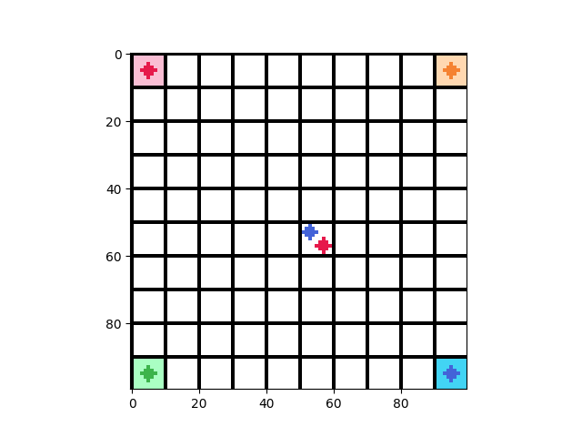

# Voronoi Interactive Sim

Work in Progress. A simulator to visualize the voronoi game with
different unit placements.

## Features

1. Utility functions to deal with coords:
```
Test - Pos: (2.649603986720316, 7.00243706171401)
  Pixel: (26, 70)
  Cell: (2, 7)
  Cell Coord: [2.5 7.5]
```

2. Variable Grid Size
3. Print Grid: 2D map showing which cells are occupied.  
   0-3 means cell is occupied by that player. 4 means contested.   
   5 means occupancy/dispute has not been computed.
```
Unit Occupancy Grid:
 [[0 5 5 5 5 5 5 5 5 1]
 [5 5 5 5 5 5 5 5 5 5]
 [5 5 5 5 5 5 5 5 5 5]
 [5 5 5 5 5 5 5 5 5 5]
 [5 5 5 5 5 5 5 5 5 5]
 [5 5 5 5 5 5 5 5 5 5]
 [5 5 5 5 5 5 5 5 5 5]
 [5 5 5 5 5 5 5 5 5 5]
 [5 5 5 5 5 5 5 5 5 5]
 [2 5 5 5 5 5 5 5 5 3]]
```

4. Visualize Occupancy Grid.  
In the below image, the occupancy status of white cells has not 
   yet been computed. (Only cells with a single unit inside them is
   considered occupied).
    

5. Map-Based Unit status
The units are shown on a (N, N, 4) grid where N is map size. 
   Note: The history of individual units cannot be tracked.
   
