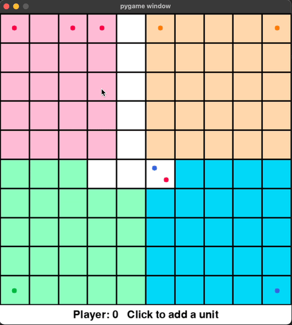

# Voronoi Pygame Sim


This is an optimized recreation of the simulator for the Voronoi Game for COMS 4444 class at Columbia.  
Voronoi Game: 100x100km grid, each cell is 1x1km. Each cell is controlled by the unit closest to that cell. 
Each player spawns one unit every N days. Every unit can move 1km per day. If a unit is isolated from it's 
home base, it gets killed. The controlled area is added to the total score at the end of each day.

Much faster simulator for the voronoi game. Primary features:
- Speed: 1000 days in ~36 sec (default player)
- Identical player interface: Just replace `players/<gr>_player.py` file with the file from official sim's 
  `players/<gr>_player.py` file. No changes required.
- Debug code: A breakpoint in the code will pause the simulation, allowing analysis of the current game state
  with visuals.
- Video export: Export a video of the game, if needed. Just add a `--video` flag.

The simulator uses pygame for the visualization. It also has a few under-the-hood optimizations to make it run
faster.

Each of the player's code is copied from the original repo for testing. Credits due to the respective authors.

### Launch:

```shell
python main.py --days 100 --spawn 5 -p1 d -p2 1 -p3 8 -p4 5 
```

Usage:
```
usage: main.py [-h] [--map_size MAP_SIZE] [--no_gui] [--days DAYS] [--spawn SPAWN] 
    [--player1 PLAYER1] [--player2 PLAYER2] [--player3 PLAYER3] [--player4 PLAYER4] 
    [--fps FPS] [--timeout TIMEOUT] [--seed SEED] [--out_video]

COMS 4444: Voronoi

optional arguments:
  -h, --help            show this help message and exit
  --map_size MAP_SIZE, -m MAP_SIZE
                        Size of the map in km
  --no_gui, -g          Disable GUI
  --days DAYS, -d DAYS  Total number of days
  --spawn SPAWN         Number of days after which a new unit spawns at the homebase
  --player1 PLAYER1, -p1 PLAYER1
                        Specify player 1 out of 4. Integer equal to player id.
  --player2 PLAYER2, -p2 PLAYER2
                        Specify player 2 out of 4. Integer equal to player id.
  --player3 PLAYER3, -p3 PLAYER3
                        Specify player 3 out of 4. Integer equal to player id.
  --player4 PLAYER4, -p4 PLAYER4
                        Specify player 4 out of 4. Integer equal to player id.
  --fps FPS, -f FPS     Max speed of simulation
  --timeout TIMEOUT, -t TIMEOUT
                        Timeout for each players execution. 0 to disable
  --seed SEED, -s SEED  Seed used by random number generator. 0 to disable.
  --out_video, -o       If passed, save a video of the run. Slows down the simulation 2x.
```

In the simulator
```
Key bindings:  
  - Esc: Quit the game.   
  - P: Pause the game
  - R: Reset game
```

### Install

Project was created with Python 3.9. Install dependencies with:

```shell
pip install -r requirements.txt
```

Saving videos also needs ffmpeg installed on the system.

### Coordinate System

We use an X-right, Y-down coordinate system. (same as original sim) 
In order to make computation easy, our coordinate system follows from numpy indexing (Origin: Top-left)  

Note: Y-axes represents columns. So a unit at `location[10, 30]` is at `cell[30, 10]`.

# Voronoi Interactive Sim


<p align="center">100x100 grid showing occupancy</p>

A simulator to visualize the voronoi game with different unit placements.  
Click to add units

Key bindings:  
  - Esc: Quit the game.  
  - 1-4: Select player 0-3  
  - R: Reset game
  - K: Kill isolated units  


#### Launch:

```shell
python main_interactive.py [-m <map_size>]
```

## Features

1. Blazing Fast! Uses KDTree to find nearest points for each cell.
   In a 100x100 grid with 100 units each player,
   the initial occupancy is computed in 170ms.
2. Variable Grid Size - Visualize strategies on a smaller map


# Player - Dev thoughts

- Identify when commando is in danger of being cut off: 
  - get the center line of the polygon 
    - densify superpoly boundary, voronoi diagram of these points, take all vertices 
      inside superpoly and join into a line)
  - find enemies closing in to cut off:
    - project all enemy points to poly centerline. If len of any projection is less than
      threshold, it's in danger
  - ALTERNATE: Simplify the home poly with the distance equal to threshold. Any
    "fingers" will be cut off. Taking the diff against home poly with identify those regions.
    If a cmdo unit is within a cut finger, it's in danger.
  - if in danger, retreat to anchor

- Commando positioning:
  - Get linestring of the border: all points with neigh enemies. 
    - Optional: Line offset by an amount away from home base: use left/right based on dot product
      of line from map center to home base
  - Densify border linestr with num of points equal to num of ready commando units + 2 
    (ignore points at map border)
  - These will serve as Cmdos anchors. They cannot go too far from their anchor.
  - When a new commando squad is added, new anchors created. Assign cmdo squads to them based
    on nearest unit.
- Commando state machine:
  - getting ready state: move to a rally point, wait for all units to arrive into formation
  - ready state: can be assigned an anchor point
  - fighting state: reached anchor point. Target closest valid enemy
  - retreat state: in danger. head towards anchor point
  - recruit state: lost a unit. head to anchor point, wait to recruit new unit
  - dead: all units dead. Delete the cmdo squad object
- Reinforcement units: Optional. extra units that are kept in reserve in case a comando squad is disbanded
 
- D1 line - ideal num of units = points on border.
  - get ratio of total player units vs ideal units, recruit based on that. We dont want the line to
    be too dense.
  - Send recruited units to a vertex (need a class and state machine???)
- Engineer kamikaze units:
  - Designated for opening holes in dense enemy defenses by occupying same cell
- Conquering units:
  - If an enemy home base is compromised, convert cmdo squad to conq squad. They position themselves 
    around the enemy home base indefenitely.
- Predict enemy movement - send commando units on an intercept course. 
  - If the intercept point is too far from anchor point, lose target, retreat.
  - If in danger of getting cut off, lose target, retreat.
- Identify targets based on dbscan. dist=5 should be good. Lock onto valid target 
  closest to cmdo squad
  - Once a target is locked on, only change target on lose target condition
- Add 3 cmdo anchor points within home polygon for defense: along center line of home poly
  - Joining points into a line is solved using travelling salesman problem. Same can be achieved using
    the convex hull of these points. Problem is picking a start and end point.

# Dev thoughts

- TODO: Add player color next to player name
- TODO: TA sim slows down as it progresses. Port optimizations from here.
- TODO: Use Voronoi diagram - map each player to unit. Must be able to find a node/voronoi cell given
  a unit ID. Create a graph from this map. Use to identify isolated units and build occ map.


Ambition:
- Pause game and enter interactive mode. Add units and see what will happen.

Interactive Mode:
- TODO: Remove units with click (shift-click or change mode with key)
- TODO: (Low priority) Click and drag to move units

- TODO: Remi - replace SVG graphics with an image container
       VIDEO: https://www.reddit.com/r/RemiGUI/comments/9skkag/streaming_images_from_a_webcam/

 
#### Game State 
Stores a list of units, compute occupancy map, killed units. Compute new unit pos based on move
commands for each unit. Occupancy map and killed units can be brute force (more efficient).
Needs to maintain exact coords and unique ID of each unit. This is passed to players.
      
Exposed to Player: 
   - List of units (player, exact pos, id). 
   - Occupancy Map. 
   - Curr/total score.
   - Curr/total days.
   - (removed to match interface) History (units, move commands, occ map) - easier motion tracking
   - (removed to match interface) Move units. 
  
#### GUI 
Main code that is launched and handles all interfaces.  
Allows: start/stop/reset game, enable interactive mode.  
Does: Initialize player code,  log errors.  
