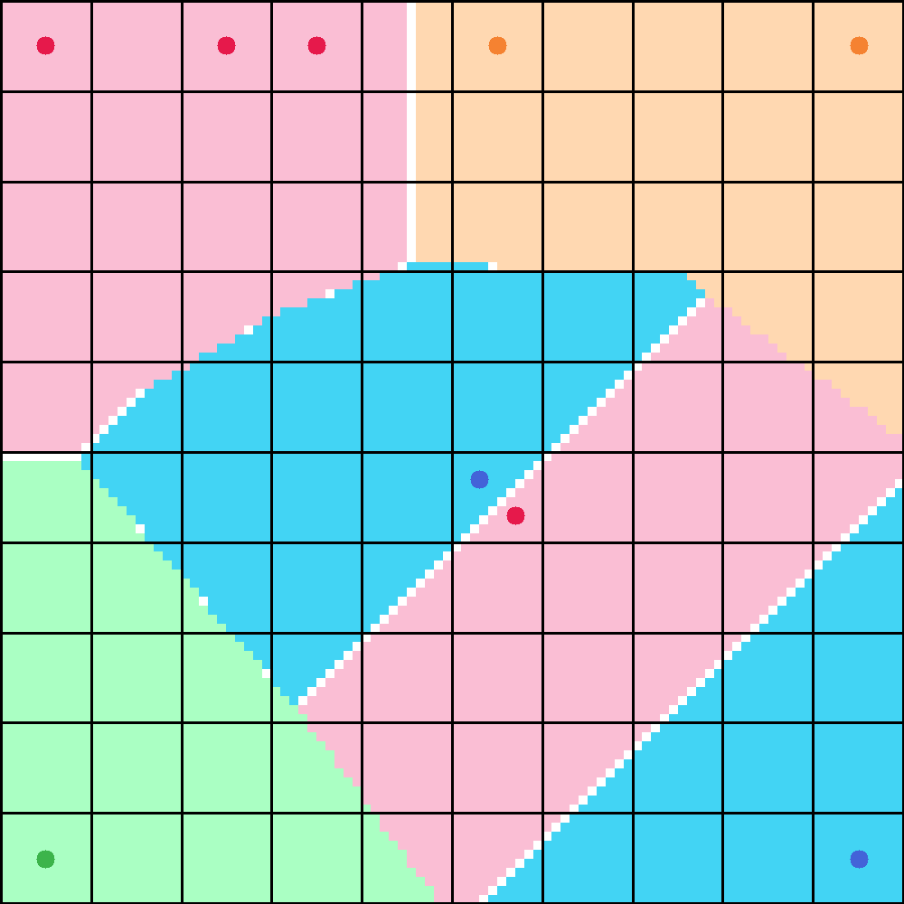
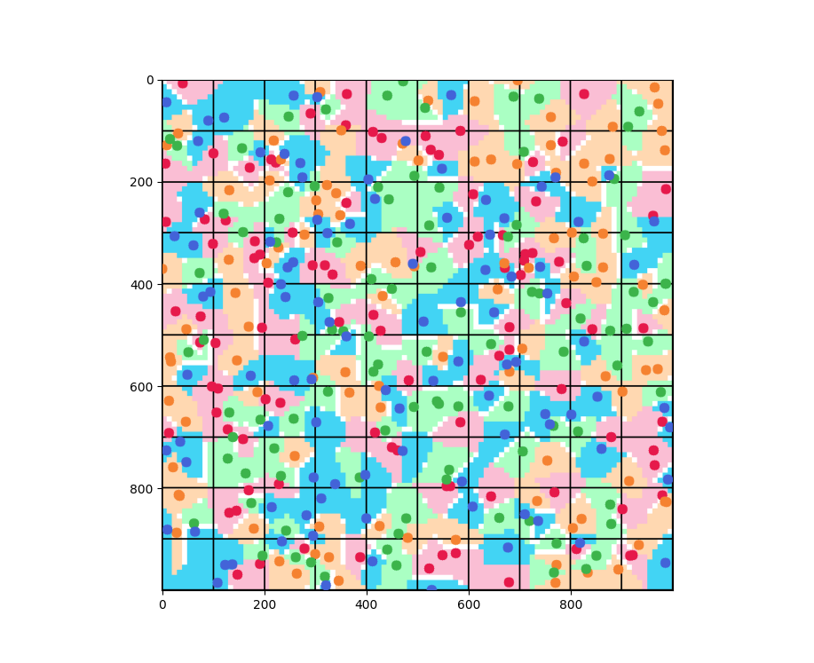
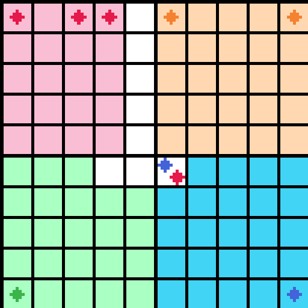
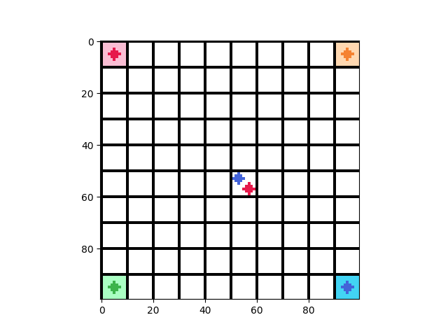

# Voronoi Interactive Sim


<p align="center">100x100 grid showing occupancy</p>

Work in Progress. A simulator to visualize the voronoi game with
different unit placements.

## Coordinate System

In order to make computation easy, our coordinate system follows numpy indexing.   

Origin: Top-left  
X-Axis: Top -> Bottom  
Y-Axis: Left -> Right  

Note: In ordinary metric cases, x is left->right. If using that system, pass metric coords as (y, x)

## Features

1. Blazing Fast! Uses KDTree to find nearest points for each cell.
   In a 100x100 grid with 100 units each player,
   the occupancy is computed in 170ms. For a 1000x1000 grid, it takes only
   740ms.
   
   <p align="center">Occupancy Grid: 170ms to compute. 100x100 grid with 400 random units</p>

2. Variable Grid Size
3. Add Units to Grid
4. Represent Units Placement with multi-dimensional array (N, N, 4)  
   Note: The history of individual units cannot be tracked.
5. Visualize and Print Occupancy Grid. Here's a 10x10 grid:


   

   
   ```
   Occupancy Grid:
    [[0 0 0 0 4 1 1 1 1 1]
     [0 0 0 0 4 1 1 1 1 1]
     [0 0 0 0 4 1 1 1 1 1]
     [0 0 0 0 4 1 1 1 1 1]
     [0 0 0 0 4 1 1 1 1 1]
     [2 2 2 4 4 4 3 3 3 3]
     [2 2 2 2 2 3 3 3 3 3]
     [2 2 2 2 2 3 3 3 3 3]
     [2 2 2 2 2 3 3 3 3 3]
     [2 2 2 2 2 3 3 3 3 3]]
   ```
   0-3: Player ID  
   4: Disputed

### Debugging Features

1. Utility functions to deal with coords:
```
Test - Pos: (2.649603986720316, 7.00243706171401)
  Pixel: (26, 70)
  Cell: (2, 7)
  Cell Coord: [2.5 7.5]
```

2. Print and Visualize Unit Based Grid:  
   2D map showing which cells are occupied because of units present 
   within them.  
   0-3 means cell is occupied by that player. 4 means contested.   
   5 means no unit present (occupancy/dispute has not been computed yet).

   ```
   Unit Occupancy Grid:
    [[0 5 5 5 5 5 5 5 5 1]
    [5 5 5 5 5 5 5 5 5 5]
    [5 5 5 5 5 5 5 5 5 5]
    [5 5 5 5 5 5 5 5 5 5]
    [5 5 5 5 5 5 5 5 5 5]
    [5 5 5 5 5 4 5 5 5 5]
    [5 5 5 5 5 5 5 5 5 5]
    [5 5 5 5 5 5 5 5 5 5]
    [5 5 5 5 5 5 5 5 5 5]
    [2 5 5 5 5 5 5 5 5 3]]
   ```

   Only cells with a single unit inside them are considered occupied:
    

   
