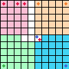

# Voronoi Interactive Sim

Work in Progress. A simulator to visualize the voronoi game with
different unit placements.

## Features

1. Variable Grid Size
2. Add Units to Grid
3. Represent Units Placement with multi-dimensional array (N, N, 4)  
   Note: The history of individual units cannot be tracked.
4. Visualize and Print Occupancy Grid

   
   
   ```
   Occupancy Grid:
    [[0 0 0 0 0 1 1 1 1 1]
    [0 0 0 0 0 1 1 1 1 1]
    [0 0 0 0 0 1 1 1 1 1]
    [0 0 0 0 0 1 1 1 1 1]
    [0 0 0 0 0 1 1 1 1 1]
    [2 2 2 2 2 4 3 3 3 3]
    [2 2 2 2 2 3 3 3 3 3]
    [2 2 2 2 2 3 3 3 3 3]
    [2 2 2 2 2 3 3 3 3 3]
    [2 2 2 2 2 3 3 3 3 3]]
   ```
   0-3: Player ID  
   4: Disputed

### Debugging Features

1. Utility functions to deal with coords:
```
Test - Pos: (2.649603986720316, 7.00243706171401)
  Pixel: (26, 70)
  Cell: (2, 7)
  Cell Coord: [2.5 7.5]
```

2. Print and Visualize Unit Based Grid:  
   2D map showing which cells are occupied because of units present 
   within them.  
   0-3 means cell is occupied by that player. 4 means contested.   
   5 means no unit present (occupancy/dispute has not been computed yet).

   ```
   Unit Occupancy Grid:
    [[0 5 5 5 5 5 5 5 5 1]
    [5 5 5 5 5 5 5 5 5 5]
    [5 5 5 5 5 5 5 5 5 5]
    [5 5 5 5 5 5 5 5 5 5]
    [5 5 5 5 5 5 5 5 5 5]
    [5 5 5 5 5 4 5 5 5 5]
    [5 5 5 5 5 5 5 5 5 5]
    [5 5 5 5 5 5 5 5 5 5]
    [5 5 5 5 5 5 5 5 5 5]
    [2 5 5 5 5 5 5 5 5 3]]
   ```

   Only cells with a single unit inside them are considered occupied:
    

   
